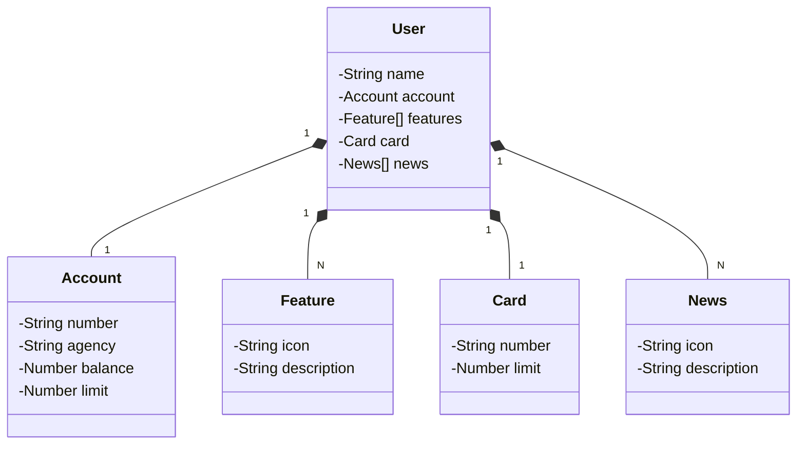

# Banking Java API using Gradle, REST and PosgreSQL

RESTful API for Banking services built in Java 17 with Spring Boot 3.

## Main technologies:

 - **Java 17**: We will use the latest LTS version of Java to take advantage of the latest innovations offered by this robust and widely used language;
 - **Spring Boot 3**: We will work with the newest version of Spring Boot, which maximizes developer productivity through its powerful autoconfiguration premise;
 - **Spring Data JPA**: We will explore how this tool can simplify our data access layer, facilitating integration with SQL databases;
 - **OpenAPI (Swagger)**: We will create effective and easy-to-understand API documentation using OpenAPI (Swagger), perfectly aligned with the high productivity offered by Spring Boot;
 - **Railway**: makes it easy to deploy and monitor our solutions in the cloud, as well as offering various databases as a service and CI/CD pipelines.

## [Figma link](https://www.figma.com/file/0ZsjwjsYlYd3timxqMWlbj/SANTANDER---Projeto-Web%2FMobile?type=design&node-id=1421%3A432&mode=design&t=6dPQuerScEQH0zAn-1)

Figma was used to abstract the domain of this API, being useful in the analysis and design of the solution.

## Class Diagram (API Domain)

## API Documentation (Swagger)

### [https://sdw-2023-prd.up.railway.app/swagger-ui.html](https://sdw-2023-prd.up.railway.app/swagger-ui.html)

This API will be available on Railway for a limited time, but this is open source. So feel free to clone it, modify it (as it is a good base project for new projects) and run it locally or wherever you find it most interesting! Just don't forget to tag us when you release your solution 🥰

### IMPORTANT

For those interested in developing the Santander home screen (Figma) in Angular, Android, iOS or Flutter... If the production URL is no longer available, we leave a Backup on GitHub Pages, just GET it there 😘
- Production URL: https://sdw-2023-prd.up.railway.app/users/1
- Mock (Backup): https://digitalinnovationone.github.io/santander-dev-week-2023-api/mocks/find_one.json

## Setup

Add environment variable to run in development mode:

In Run / Debug configurations, in the [Edit configurations] option, add in environment variables:

`SPRING_PROFILES_ACTIVE=dev`

### Testing

Run the application in development mode, open the browser:

http://localhost:8080/h2-console

Use:

    url: jdbc:h2:mem:sdw2023
    username: sdw2023
    password:

Test the connection, then connect to the database.

